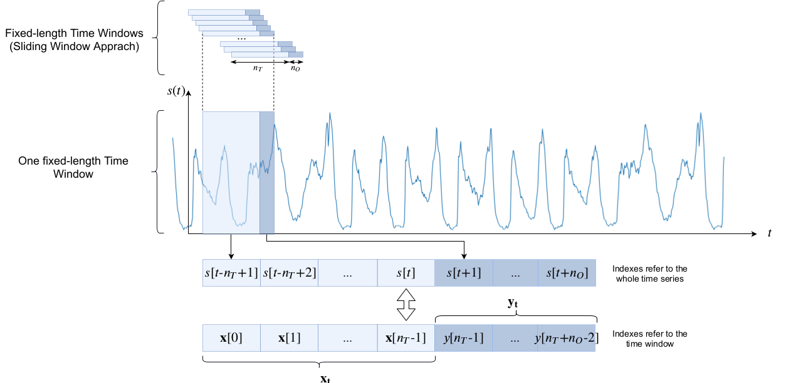
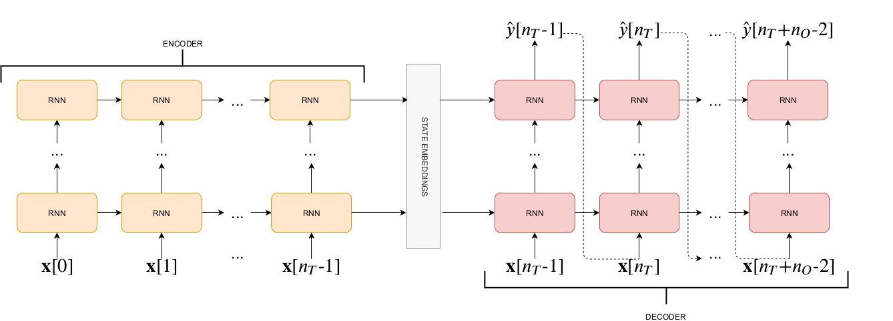
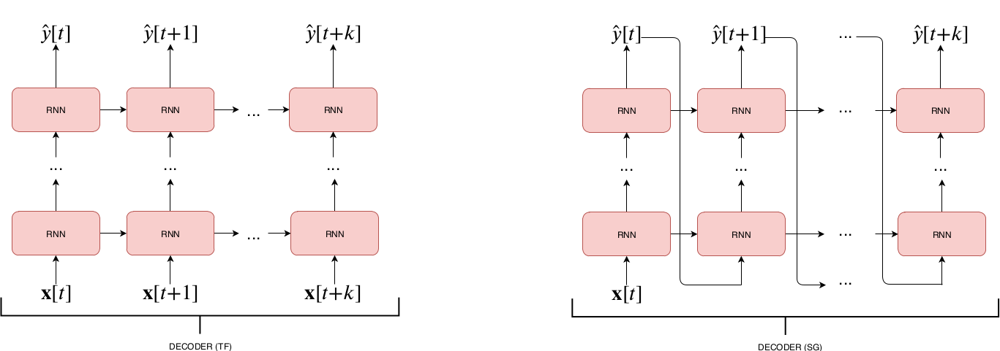
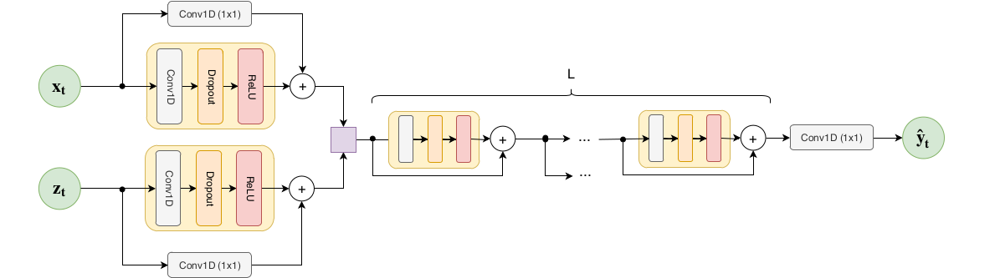
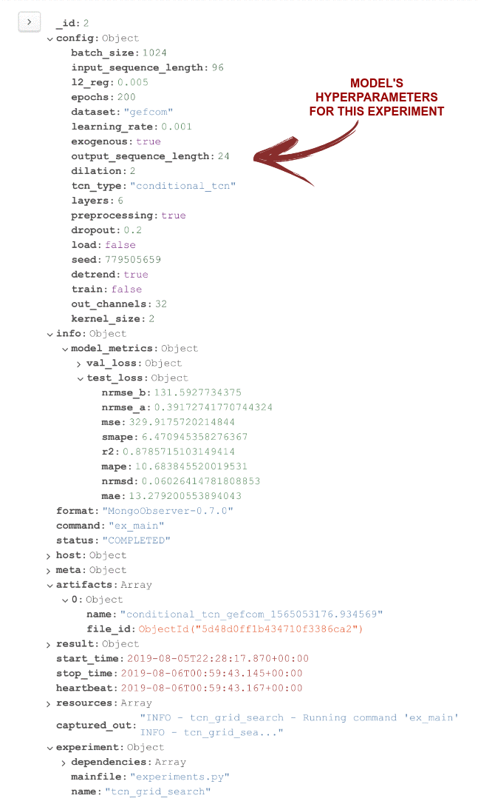

# DTS - Deep Time-Series Forecasting

DTS is a [Keras](https://keras.io/) library that provides multiple deep architectures aimed at multi-step time-series forecasting.

The [Sacred](https://github.com/IDSIA/sacred) library is used to keep track of different experiments and allow their reproducibility. 

## Installation
DTS is compatible with Python 3.5+, and is tested on Ubuntu 16.04. 

The setup.py script of DTS will not attempt to install Sacred, Keras and a backend for it. 
Thus, **before installing DTS**, you have to  manually install:
- The CPU or GPU version of Tensorflow (GPU recommended) <=1.14.0
- Keras <= 2.2.4
- Sacred <=0.7.5
- (Optional) [MongoDB](https://www.mongodb.com/) is also recommended.

This choice has been taken in order to avoid any possible problem for the user. If you are already a Keras/Tesorflow user
mind that if your version of Tensorflow is greater or equal to 1.14.0 then you need to check out this [issue](https://github.com/IDSIA/sacred/issues/493) to install sacred correctly.

I have tested dts with the following dependencies:

|      ENV 1       |      ENV 2        |
|:----------------:|:-----------------:|                     
|numpy==1.14.2     | numpy==1.17.0     |
|tensorflow==1.12.0| tensorflow==1.14.0|
|keras==2.1.6      | keras==2.2.4      |
|sacred==0.7.4     | sacred==0.7.5     |

To install dts from source:
```
git clone https://github.com/albertogaspar/dts.git
cd dts
pip install -e .
```


# What's in it & How to use

#### Time-Series Forecasting
The package includes several deep learning architectures that can be used for multi step-time series forecasting. 
The package provides also several utilities to cast the forecasting problem into a supervised machine learning problem. 
Specifically a sliding window approach is used: each model is given a time window of size n<sub>T</sub> and asked 
to output a prediction for the following n<sub>O</sub> timesteps (see Figure below).

<p align="center">
  
</p>

#### Run Experiment
```bash
python FILENAME.py --add_config FULLPATH_TO_YAML_FILE 
```
or:
```bash
python FILENAME.py --add_config FULLPATH_TO_YAML_FILE --grid_search 
```

_grid_search_: defines whether or not you are searching for the best hyperparamters. 
If True, multiple experiments are run, each with a different combination of hyperparamters. 
The process terminates when all possible combinations of hyperparamers have been explored. 

_add_config_: The experiment's hyperparamters should be defined as a yaml file in the config folder 
(see [How to write a config file](https://github.com/albertogaspar/dts/blob/master/config) for more details). FULLPATH_TO_YAML_FILE is the fullpath to 
the .yaml file that stores your configuration.
The main function for your model should always look similar to this one:

_observer_: all the important information in an experiment can be stored either in MongoDB 
(default choice) or in multiple files (txt and json) inside a given folder (`dts/logs/sacred/`).
 Mongo Observer which stores all information in a MongoDB
If you want to use the file-based logger then launch the script with the additional argument `--observer file`
(once again, the default choice is `--observer mongodb`)

If you want to train a model using **pretrained weights** just run the model providing the paramter --load 
followed by the fullpath to the file containing the weights.
```bash
python FILENAME.py --add_config FULLPATH_TO_YAML_FILE --load FULLPATH_TO_WEIGHTS 
```
The model will be initilized with this weights before training.

 

#### Datasets
- **Individual household electric power consumption Data Set**: Measurements of electric power consumption in _one household_ with a one-minute sampling rate over a period of almost 4 years.
[Dataset & Description](https://archive.ics.uci.edu/ml/datasets/individual+household+electric+power+consumption).
- **GEFCom 2014**: hourly consumption data coming from ISO New England (aggregated consumption).
[Dataset & Description](http://blog.drhongtao.com/2017/03/gefcom2014-load-forecasting-data.html), 
[Paper](https://www.sciencedirect.com/science/article/pii/S0169207016000133?via%3Dihub).
If you use the GEFCom2014 you should cite this [paper](https://www.sciencedirect.com/science/article/pii/S0169207016000133?via%3Dihub) to acknowledge the source.

With DTS you can model your input values in many diffrent ways and then feed them to your favourite 
deep learning architectures. E.g.: 
- you can decide to include **exogenous features** (like temperature readings) if they are available.

- you can decide to apply **detrending** to the time series (see `dts.datasets.*.apply_detrend` for more details).

See [how to format your data](https://github.com/albertogaspar/dts/blob/master/dts/datasets) or check out the examples in `dts.examples` to know more about data formatting and the 
possibilities offered by DTS.

#### Available architectures
Included architectures are:
- **Recurrent Neural Networks** (Elmann, LSTM, GRU) with different trainig procedure:
  - [X] _MIMO_: a Dense Network is used to map the last state of the RNN to the output space of size n<sub>O</sub>. 
    The training and inference procedures are the same.
    
    <p align="center">
      
    </p>

  - [X] _Recursive_: The RNN is trained to predict the next step, i.e. the output space during training has size 1. During inference, 
    the network is fed with (part of) the input plus it's own predictions in a recurrent fashion until an ouput vector of length 
    n<sub>O</sub> is obtained.
  
    <p align="center">
      
    </p>
  
- **Seq2Seq**:

    <p align="center">
      
    </p>

    different training procedure are available (see [Professor Forcing: A New Algorithm for Training Recurrent Networks](https://arxiv.org/abs/1610.09038) for more details)
    - [X] _Teacher Forcing_ 
    - [X] _Self-Generated Samples_
    - [ ] _Professor Forcing_ : TODO
      
    <p align="center">
      
    </p>
    
- **Temporal Convolutional Neural Networks**:
    
    <p align="center">
      
    </p>

  - [X] _MIMO_ training/inference:
      - [X] [Wavenet](https://arxiv.org/abs/1609.03499)
      - [X] [TCN](https://arxiv.org/abs/1803.01271)
      - [X] [Conditional TCN](https://arxiv.org/abs/1703.04691)
  - [ ] _Recursive_ training/inference: TODO (The methods to perform prediction with this
  strategy is available in `dts.models.TCN.py` but has not been tested and there is no example
  to use a TCN with this mode in `dts.examples.tcn.py`)
  

- **Feedforward Neural Networks**: 
    - [X] _MIMO_ training/inference:
    - [X] _Recursive_ training/inference
- **ResNet** a feedforward neural network with residual connections:
    - [X] _MIMO_ training/inference:
    - [X] _Recursive_ training/inference


## Project Structure & TODO list
- **dts**: contains models, utilities and example to train and test different deep learning models.
- **data**: contains raw data and .npz,.npy data (already preprocessed data). 
- **config**: yaml file to be used for grid search of hyperparamteres for all architectures.
- **weights**: contains models' weights. If you use sacred using the the _artifactID_ field in each document/json file 
contains the name of the trained model that achieved the related performance. 
- **log**: If you use sacred without mongodb then all the relevant files are stored in this directory.

#### Sacred Collected Information
The animation below provides an intuitive explanation of the information collected by Sacred (using MongoDB as Observer).
The example refers to a completed experiment of a TCN model trained on the Individual household electric power consumption Data Set 
(for brevity, 'uci'):

<p align="center">
  
</p>

When MongoDB is used as an Observer, the collected information for an experiment is stored in a document. 
In the above documents are visualized using [MongoDB Compass](https://www.mongodb.com/products/compass?lang=it-it) 

## Reference
This is the code used for the [Deep Learning for Time Series Forecasting: The Electric Load Case](https://arxiv.org/abs/1907.09207) paper.
Mind that the code has been changed a bit, thus you may notice some differences with the models described in the paper.
If you encounter any problem or have any doubt don't hesitate to contact me. 

If you find it interesting it please consider citing us:
```
@article{gasparin2019deep,
  title={Deep Learning for Time Series Forecasting: The Electric Load Case},
  author={Gasparin, Alberto and Lukovic, Slobodan and Alippi, Cesare},
  journal={arXiv preprint arXiv:1907.09207},
  year={2019}
}
```