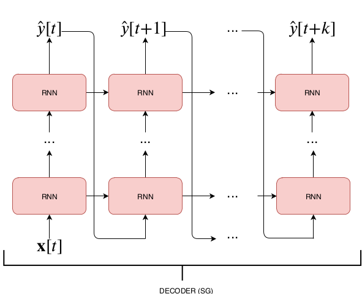

## DTS - Deep Time-Series Forecasting

A Keras library for multi-step time-series forecasting.


# What it contains
The package includes several deep learning architectures that can be used for multi step-time series forecasting. 
The package provides also several utilities to cast the forecasting problem into a supervised machine learning problem. 
Specifically a sliding window approach is used where each model is given a time window of size $n_T$ and asked to output a prediction for the following $n_O$ timesteps (see Figure below)


Included architetures are:
- Feed Forward networks with and without residual connections.
- Recurrent Neural Networks (Elmann, LSTM, GRU) with different trainig procedure:
  - MIMO: a Dense network is used to map the last state of the RNN to the output space 
  - Recurrent:
- Seq2Seq:
  
  different training procedure are available (see [Professor Forcing: A New Algorithm for Training Recurrent Networks](https://arxiv.org/abs/1610.09038) for more details)
  - Teacher Forcing: 
  - Self-Generated: 
  - TODO: [Professor Forcing](https://arxiv.org/abs/1610.09038), [Scheduled Sampling](https://arxiv.org/abs/1506.03099) 
- Temporal Convolutional Neural Networks:
    
  - [Wavenet](https://arxiv.org/abs/1609.03499)
  - [TCN](https://arxiv.org/abs/1803.01271)
  - [Conditional TCN](https://arxiv.org/abs/1703.04691)
  
The [Sacred](https://github.com/IDSIA/sacred) library is used to keep track of different experiments and allow their reproducibility. 
The installation of [MongoDB](https://www.mongodb.com/) is not mandatory but highly recommended.

# Datasets
- **Individual household electric power consumption Data Set**: Measurements of electric power consumption in _one household_ with a one-minute sampling rate over a period of almost 4 years.
[Dataset & Description](https://archive.ics.uci.edu/ml/datasets/individual+household+electric+power+consumption), 
- **GEFCom 2014**: hourly consumption data coming from ISO New England (aggregated consumption).
[Dataset & Description](http://blog.drhongtao.com/2017/03/gefcom2014-load-forecasting-data.html), [Paper](https://www.sciencedirect.com/science/article/pii/S0169207016000133?via%3Dihub)

# Reference
This is the code used for [Deep Learning for Time Series Forecasting: The Electric Load Case](https://arxiv.org/abs/1907.09207).
Mind that the code has been changed a bit, thus you may notice some differences. If you find it interesting it please consider citing us:
```
@article{gasparin2019deep,
  title={Deep Learning for Time Series Forecasting: The Electric Load Case},
  author={Gasparin, Alberto and Lukovic, Slobodan and Alippi, Cesare},
  journal={arXiv preprint arXiv:1907.09207},
  year={2019}
}
```